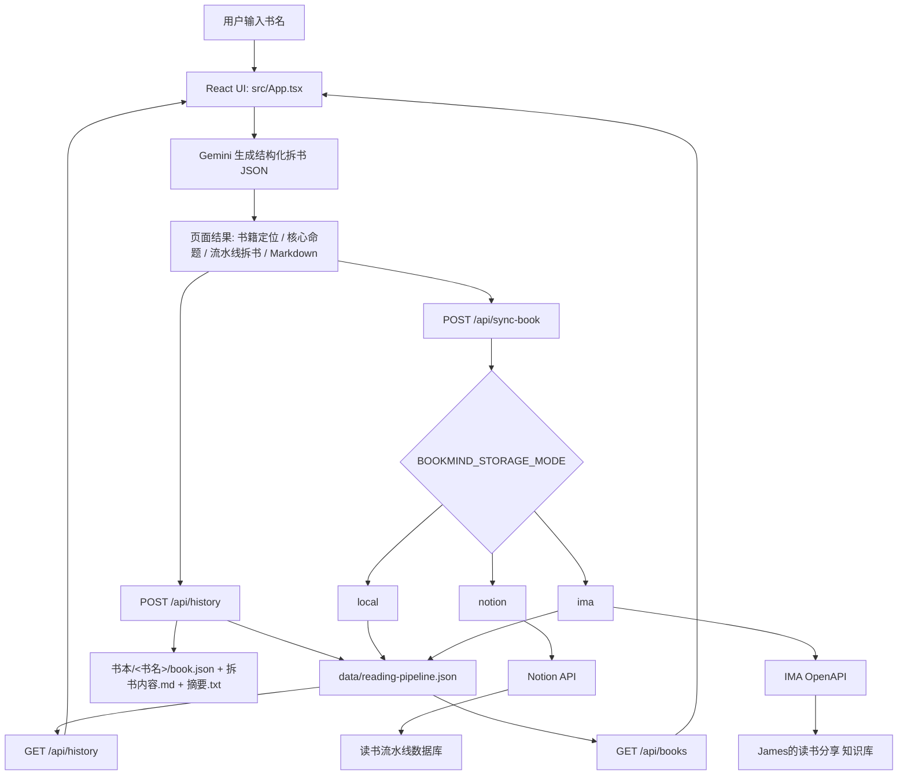
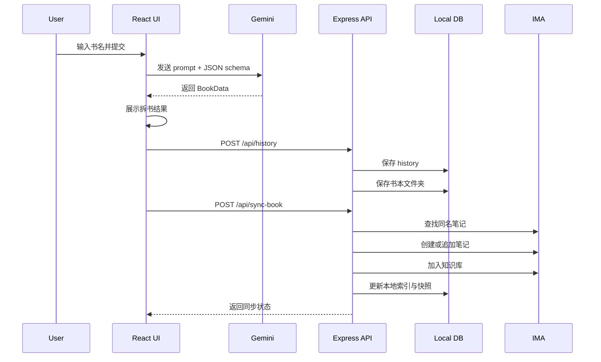
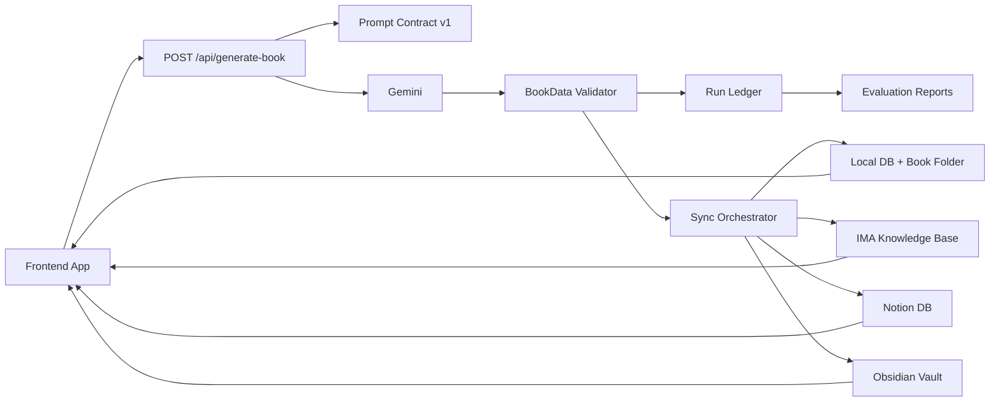

# James Reading OS Harness Engineering System Map

> 目标：把 James Reading OS 从“输入一本书 -> AI 生成拆解”的单点工具，梳理成一个可运行、可验证、可持续沉淀的 AI 读书系统。

## 1. Harness Engineering 视角

Harness Engineering 的核心判断是：AI 产品的可靠性不只来自模型，而来自包在模型外面的整套系统。

在 James Reading OS 里，模型负责生成书籍拆解；Harness 负责定义输入、约束输出、管理上下文、调用工具、保存记忆、查重、同步外部知识库、展示结果、观察失败并形成下一轮改进。

参考来源：
- https://www.harness-engineering.xyz/
- https://harness-engineer.ai/what-is-harness-engineering
- https://nestr.io/blog/harness-engineering-ai-agents

James Reading OS 可以被理解为：

```text
James Reading OS Agent = Gemini Model + Reading Harness
```

其中 Reading Harness 包括：

```text
上下文工程 + 输出结构约束 + 存储工具 + 同步工具 + 去重规则 + 本地记忆 + 用户界面 + 反馈循环
```

## 2. 产品系统一句话

James Reading OS 是一个“AI 读书流水线系统”：用户输入书名，系统生成高密度拆书内容，并自动沉淀到本地目录、IMA 知识库和读书流水线索引中，让每本书成为长期可检索、可复用、可继续演化的知识资产。

## 3. 当前系统边界

### 用户侧能力

- 输入一本书名。
- 生成书籍定位、核心命题、主题模块、结论、读书流水线拆书、Obsidian Markdown。
- 查看已拆解目录。
- 查看读书流水线数据库。
- 复制或下载 Markdown。
- 默认同步到 IMA 知识库 `James的读书分享`。
- 同时保存到本地 `书本/<书名>/` 文件夹。

### 工程侧能力

- React 前端负责输入、展示、历史选择、同步状态反馈。
- Gemini 负责生成结构化 JSON。
- Express 后端负责本地数据库、IMA 同步、Notion 同步、本地书本文件夹导出。
- 本地 JSON 文件负责长期保存索引、历史和快照。
- Vite 代理前端 `/api/*` 到后端。

## 4. 系统架构图



## 5. Harness Loop

Harness Engineering 可以用 `Define -> Execute -> Evaluate -> Observe` 来看 James Reading OS。

### 5.1 Define: 定义系统应该做什么

当前定义已经写在前端 Gemini prompt 和 JSON schema 里。

位置：
- `src/App.tsx`
- `handleGenerate`
- `responseSchema`

定义内容：
- 输入：一本书名。
- 输出：严格 JSON。
- 必须包含：书籍定位、核心命题、主题模块、结论、读书流水线、展示建议、Obsidian Pipeline。
- 风格约束：高密度、清晰、可直接入库、偏你的读书流水线风格。

现状评价：
- 这部分已经是系统里最强的 Harness。
- 但 prompt 和 schema 都在 `App.tsx` 里，后续应该抽到独立文件，变成可版本化的 Prompt Contract。

### 5.2 Execute: 驱动模型和工具执行

执行链路：

```text
用户输入书名
-> Gemini 生成 BookData
-> 前端展示 BookData
-> /api/history 保存历史
-> /api/sync-book 根据 storage mode 同步
-> 本地文件夹导出
```

核心执行文件：
- `src/App.tsx`
- `server.ts`

执行工具：
- Gemini API
- 本地文件系统
- IMA OpenAPI
- Notion API

现状评价：
- 产品已经不是单纯 AI demo，而是一个带工具链的 compound AI system。
- 当前最大问题是前端直接调用 Gemini，后端保存数据；这会让模型调用、存储调用分散在两端，后续应收敛到后端统一编排。

### 5.3 Evaluate: 评估结果是否合格

当前已有的评估机制：

- TypeScript 类型约束。
- Gemini `responseSchema` 约束输出结构。
- `normalizeBookKey` 做书名去重。
- `/api/preview-book` 在部分模式下可预览写入变化。
- `/api/sync-book` 检查缺少书籍标题时返回 400。
- IMA / Notion 配置缺失时返回 503。

缺失的评估机制：

- 没有自动验证生成内容质量。
- 没有检测模型是否编造作者、案例、书名。
- 没有 JSON 内容完整度评分。
- 没有同步成功后的端到端测试。
- 没有 IMA 写入后再读回校验。
- 没有书籍文件夹导出的结构测试。

建议补上：

```text
BookData Validator
-> 字段完整度
-> 每个数组最少条数
-> Markdown 是否包含必要章节
-> 书名是否和用户输入一致
-> 作者未知时是否明确标注
```

### 5.4 Observe: 观察系统运行状态

当前可观察信息：

- 前端 loading message。
- 前端 storage message。
- 后端 API HTTP status。
- 后端启动日志。
- 本地 `data/reading-pipeline.json`。
- 本地 `书本/<书名>/` 文件夹。

缺失的可观察性：

- 没有统一日志文件。
- 没有每次生成的 run id。
- 没有记录模型请求耗时、同步耗时、失败原因。
- 没有保存 prompt 版本。
- 没有记录 IMA / Notion 写入结果快照。

建议新增：

```text
runs/<run-id>.json
```

每次拆书记录：

- runId
- inputTitle
- promptVersion
- model
- startTime / endTime
- generatedBookTitle
- validationResult
- syncTarget
- syncStatus
- localFolderPath
- errors

## 6. 当前核心数据模型

### BookData

BookData 是模型输出和页面展示的主对象。

核心字段：

- `positioning`
- `coreProposition`
- `modules`
- `conclusions`
- `readingPipeline`
- `displaySuggestions`
- `obsidianPipeline`

产品意义：

```text
BookData = 一本书被 AI 拆解后的完整知识资产
```

### ReadingPipelineRecord

ReadingPipelineRecord 是数据库和目录里的索引对象。

核心字段：

- `title`
- `dedupeKey`
- `author`
- `field`
- `status`
- `stage`
- `notionProcess`
- `source`
- `lastReviewedAt`
- `coreQuestionNotes`
- `alphaNotes`
- `imaDocId`
- `knowledgeBaseId`

产品意义：

```text
ReadingPipelineRecord = 一本书在读书流水线里的状态卡片
```

### LocalDatabase

本地数据库文件：

```text
data/reading-pipeline.json
```

结构：

- `records`: 读书流水线索引。
- `history`: 已拆解目录。
- `snapshots`: 每本书最新完整快照。

产品意义：

```text
LocalDatabase = 不依赖外部服务也不会丢的系统记忆
```

## 7. API 系统地图

### `GET /api/books`

用途：
- 读取读书流水线数据库。

根据 `BOOKMIND_STORAGE_MODE` 返回：
- `ima`: 返回本地 IMA 索引。
- `local`: 返回本地数据库。
- `notion`: 查询 Notion 数据库。

### `GET /api/history`

用途：
- 读取左侧已拆解目录。

数据来源：
- `data/reading-pipeline.json.history`

### `POST /api/history`

用途：
- 保存一次生成结果。

副作用：
- 更新 history。
- 写入 `书本/<书名>/book.json`。
- 写入 `书本/<书名>/拆书内容.md`。
- 写入 `书本/<书名>/摘要.txt`。

### `DELETE /api/history`

用途：
- 清空已拆解目录。

注意：
- 当前只清 history，不清 `records`、`snapshots` 和 `书本/` 文件夹。

### `POST /api/preview-book`

用途：
- 预览本次写入会新增、更新还是无需更新。

现状：
- local 和 notion 模式适合手动确认。
- ima 模式现在前端默认走直接同步，预览能力作为备用能力保留。

### `POST /api/sync-book`

用途：
- 把一本书同步到当前存储模式。

根据 mode 执行：
- `ima`: 创建或追加 IMA 笔记，并加入知识库。
- `local`: 写入本地数据库。
- `notion`: upsert Notion 页面并追加拆书内容。

## 8. 外部系统

### Gemini

角色：
- 内容生成模型。

当前位置：
- 前端 `src/App.tsx` 直接调用。

风险：
- API key 暴露风险取决于运行环境。
- 生成失败只显示通用错误。
- prompt 版本不可追踪。

建议：
- 移到后端 `/api/generate-book`。
- 每次生成记录 promptVersion 和 model。
- 对返回结果做 validator。

### IMA

角色：
- 默认知识库沉淀目标。

当前行为：
- 搜索同名笔记。
- 有则追加。
- 无则创建。
- 加入 `James的读书分享` 知识库。
- 同步本地索引。

风险：
- 删除接口未知，测试笔记不易清理。
- 依赖 IMA 返回字段如 `note_id` / `doc_id`。
- 同步后没有读回校验。

### Notion

角色：
- 备用读书流水线数据库。

当前行为：
- 查询数据库。
- 按规范书名查重。
- 更新或新建页面。
- 追加拆书内容块。

风险：
- 需要 Notion integration 授权数据库。
- Notion 块数量和 rich text 长度有限制，当前只取前 100 个 blocks。

### Local Files

角色：
- 最稳定的长期备份。

当前保存：

```text
data/reading-pipeline.json
书本/<书名>/book.json
书本/<书名>/拆书内容.md
书本/<书名>/摘要.txt
```

价值：
- 不依赖 IMA / Notion 也能恢复。
- 最适合后续接 Obsidian Vault。

## 9. 当前用户旅程



## 10. 关键 Harness 组件清单

| Harness 组件 | 当前实现 | 作用 | 成熟度 |
| --- | --- | --- | --- |
| Context Engineering | Gemini prompt | 规定模型该如何理解书名和你的读书风格 | 中 |
| Output Contract | Gemini responseSchema + TypeScript interface | 限制输出结构 | 中高 |
| Tool Harness | Express API + IMA / Notion / FS | 把模型结果变成真实资产 | 中 |
| Memory Harness | local JSON + 书本文件夹 | 保证每次拆书不丢 | 中高 |
| Dedupe Harness | normalizeBookKey | 避免同名书重复写入 | 中 |
| Feedback Harness | preview-book + storageMessage | 让用户看到写入结果 | 中 |
| Evaluation Harness | lint + schema | 检查代码和结构 | 初级 |
| Observability Harness | console + HTTP status | 定位运行问题 | 初级 |
| Recovery Harness | 本地文件备份 | 外部服务失败时仍有数据 | 中 |

## 11. 系统短板

### 11.1 生成链路还没有后端化

当前 Gemini 调用在前端。

影响：
- prompt 难以版本化。
- 生成日志难保存。
- 安全边界较弱。
- 无法在后端统一做验证、重试、缓存。

### 11.2 缺少正式 Validator

当前依赖 schema，但没有业务级校验。

应该校验：
- 书名是否为空。
- `modules` 是否正好或至少 3 个。
- `readingPipeline.keyModels` 是否不少于 3 个。
- `noteMarkdown` 是否包含固定章节。
- `obsidianPipeline.vaultPlacement.filename` 是否以 `.md` 结尾。

### 11.3 没有 Run 记录

现在有结果，但没有“本次运行发生了什么”的审计记录。

建议新增：

```text
runs/
  2026-04-30_<run-id>.json
```

### 11.4 IMA 同步没有读回确认

现在写入成功后更新本地索引，但没有再查一次知识库确认内容可检索。

### 11.5 Obsidian 还只是 Markdown 输出

系统已经生成 Markdown，但没有真正维护 Vault 级别的：

- `00 Inbox`
- `10 Books`
- `20 Concepts`
- `30 Questions`
- `40 MOC`

这会限制跨书关联能力。

## 12. 下一版系统路线

### Phase 1: 生成后端化

新增：

```text
POST /api/generate-book
```

职责：
- 接收书名。
- 组装 prompt。
- 调 Gemini。
- 校验 BookData。
- 保存 run log。
- 返回结果。

收益：
- 模型调用可追踪。
- prompt 可版本化。
- 错误可诊断。
- API key 不暴露到前端。

### Phase 2: BookData Validator

新增：

```text
src/shared/bookDataSchema.ts
server/validators/bookDataValidator.ts
```

校验项：
- 结构完整。
- 字段长度合理。
- 数组数量达标。
- Markdown 章节完整。
- 文件名合法。

收益：
- 把“看起来生成了”变成“生成结果合格”。

### Phase 3: Run Ledger

新增：

```text
runs/<run-id>.json
```

记录：
- 输入书名。
- 模型。
- promptVersion。
- 生成耗时。
- 校验结果。
- 同步目标。
- 同步结果。
- 错误信息。

收益：
- 每次失败都能复盘。
- 每次成功都能追踪来源。

### Phase 4: Obsidian Vault 化

把当前 `书本/<书名>/` 升级为：

```text
vault/
  00 Inbox/
  10 Books/<书名>/index.md
  10 Books/<书名>/alpha.md
  10 Books/<书名>/cases.md
  20 Concepts/<概念>.md
  30 Questions/<问题>.md
  40 MOC/读书地图.md
```

收益：
- 一本书不再是一篇孤立笔记。
- 系统开始形成跨书知识网络。

### Phase 5: Evaluation Set

建立 10 本固定测试书：

- 《思考，快与慢》
- 《穷查理宝典》
- 《证券分析》
- 《系统之美》
- 《精益创业》
- 《鞋狗》
- 《人类简史》
- 《信号与噪声》
- 《影响力》
- 《巴菲特致股东的信》

每次改 prompt 或模型后，跑一遍：

```text
generate -> validate -> compare -> report
```

收益：
- prompt 改动不会凭感觉。
- 产品质量可以持续改善。

## 13. 推荐目标架构



## 14. 最终产品定义

从 Harness Engineering 视角，James Reading OS 不应该只是一个“书籍摘要生成器”。

它应该是：

```text
一个围绕 AI 模型构建的个人阅读知识生产系统。
```

系统能力不是“回答一本书讲了什么”，而是持续完成：

```text
输入 -> 生成 -> 校验 -> 展示 -> 查重 -> 同步 -> 归档 -> 索引 -> 复盘 -> 再生成
```

这条闭环一旦稳定，模型可以换，存储可以换，UI 可以换，但你的读书系统会越来越强。
