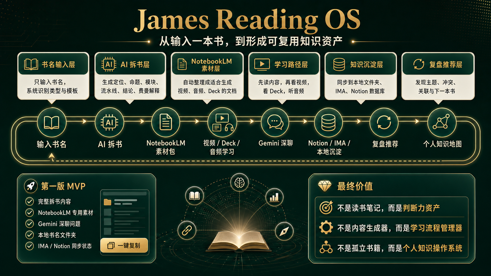

# James Reading OS

> AI-native reading operating system. Turn a book title into a reusable knowledge asset.



James Reading OS is a full-loop reading workflow for AI-native learners. Instead of producing a long generic summary, it converts a single book title into structured book intelligence, NotebookLM-ready source material, Gemini discussion prompts, local archives, IMA knowledge-base sync records, and Notion-style reading pipeline data.

The product is designed around one opinionated idea:

**The end of reading is not note-taking. It is building a personal decision system.**

## Product Loop

```text
Book title
-> AI book breakdown
-> NotebookLM source pack
-> Video / Deck / Audio learning
-> Gemini deep discussion
-> Notion / IMA / local archive
-> Review and recommendation
-> Personal knowledge map
```

## Core Capabilities

- **One-book input:** enter a book title and generate a high-density reading interface.
- **Structured breakdown:** generate positioning, core thesis, theme modules, decision checklist, transferable scenarios, alpha notes, and Feynman explanation.
- **NotebookLM-ready output:** copy a clean source document that can be used for video, audio, and deck generation workflows.
- **Knowledge persistence:** save every book into a local `书本/<book-title>/` folder with JSON, Markdown, and summary files.
- **IMA sync:** default workflow supports syncing book breakdowns to the `James的读书分享` knowledge base when credentials are configured.
- **Notion pipeline support:** keep the same reading-pipeline structure ready for a Notion database workflow.
- **Dedupe-first storage:** normalize book titles and avoid repeatedly inserting the same book into the local pipeline.
- **Professional reading UI:** warm editorial interface, reading-first typography, and clear copy actions for downstream AI tools.

## AI Output Contract

Each generated book asset follows a stable structure:

1. `一、书籍定位`
2. `二、核心命题`
3. `三、主题模块`
4. `四、读书流水线拆书`
5. `五、阅读后可直接带走的结论`
6. `六、费曼学习解释`

The Feynman section is optimized for teaching the book to another person. It includes author and era context, progressive plain-language explanation angles, and a one-sentence takeaway.

## Architecture

```text
React + Vite UI
-> Gemini structured generation
-> Express API
-> Local reading pipeline JSON
-> Per-book local folders
-> IMA OpenAPI sync
-> Notion database sync
```

Key files:

- `src/App.tsx`: main reading interface, Gemini prompt contract, copy/export workflow.
- `server.ts`: local persistence, IMA sync, Notion sync, dedupe and reading-pipeline APIs.
- `src/index.css`: product-grade visual system and editorial UI tokens.
- `HARNESS_ENGINEERING_SYSTEM.md`: Harness Engineering system map.
- `DESIGN.md`: visual design principles.
- `docs/OPTIMIZATION_LOG.md`: release and optimization notes.

## Local Setup

**Prerequisite:** Node.js 22+ recommended.

1. Install dependencies.

```bash
npm install
```

2. Copy `.env.example` to `.env.local` and configure your own credentials.

```bash
cp .env.example .env.local
```

3. Run the full app.

```bash
npm run dev:full
```

4. Open the app.

```text
http://127.0.0.1:3000
```

## Environment Variables

```text
GEMINI_API_KEY
BOOKMIND_STORAGE_MODE=ima | local | notion
NOTION_TOKEN
NOTION_DATABASE_ID
IMA_OPENAPI_CLIENTID
IMA_OPENAPI_APIKEY
IMA_KNOWLEDGE_BASE_ID
IMA_KNOWLEDGE_BASE_NAME
APP_URL
```

No real tokens are committed to this repository. Use `.env.local` for private credentials.

## Documentation

- [Harness Engineering System Map](HARNESS_ENGINEERING_SYSTEM.md)
- [Design System Notes](DESIGN.md)
- [Optimization Log](docs/OPTIMIZATION_LOG.md)

## Product Direction

James Reading OS is evolving from a book-summary interface into a compound AI system:

- First stage: single-book breakdown and persistence.
- Second stage: NotebookLM source pack and multimedia learning workflow.
- Third stage: Gemini discussion capture and Notion/IMA knowledge consolidation.
- Fourth stage: cross-book graph, review recommendations, and personal decision map.

The long-term goal is simple: every book becomes a reusable component in a personal operating system for judgment, strategy, and creation.
